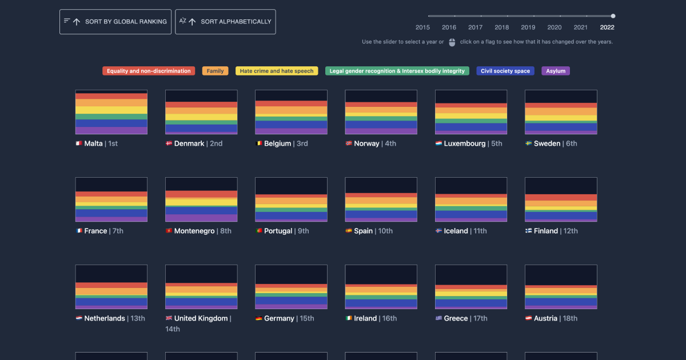

# Flags of Inequality

[flags-of-inequality.com](https://www.flags-of-inequality.com)

**If countries had equal rights for their LGBTQ+ citizens this visualization would not exist**. We make use of the rainbow flag to portray to what extent different dimensions of queer life are disregarded by state regulations.Visualizing LGBTQ+ rights in Europe.

## Methodology

We collected the rating that [ILGA-Europe](https://www.ilga-europe.org/) provides for each category for each country over the years. We also gathered the assessment that the organization does of the different criteria inside each category. The first set of information is used in the construction of the different flags, where the size is proportional to how accomplished the countries are in the promotion of equality for their LGBTQ+ community.

In 2022, Rainbow Data introduced "Intersex bodily integrity" as a seventh category. Criteria covered in this category was previously part of "Legal gender recognition and bodily integrity". To allow comparison across different years, we merged the new category with "Legal gender recognition" for the year 2022. To do so, we calculated the weighted average of the two categories based on the number of criteria covered by each.

### Data

The data in this project comes from [ILGA-Europe](https://www.ilga-europe.org/)'s yearly [Rainbow Index](https://www.rainbow-europe.org/). Because data is not currently made available in a manageable format, we scraped it from the website for the years between 2015 to 2022. All the raw data is available in the `/data` directory. The code used to fetch the data is available in this [Colab notebook](https://colab.research.google.com/drive/1PA1QGnXG1UE7DmGK11nwdwSqTsH1uMIu?usp=sharing).
